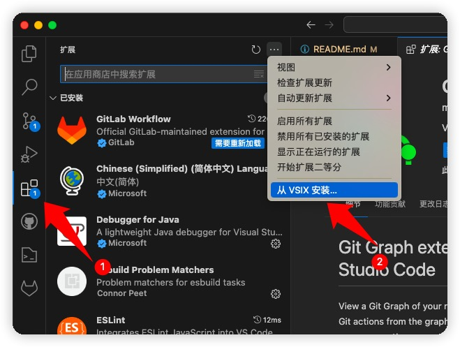
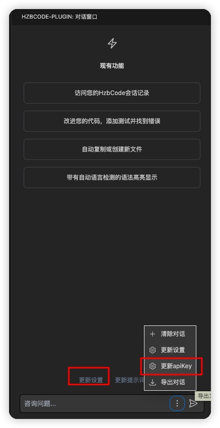
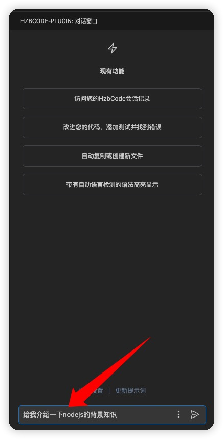
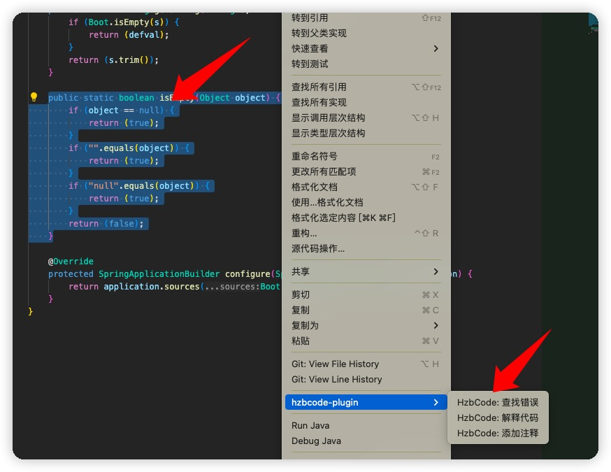
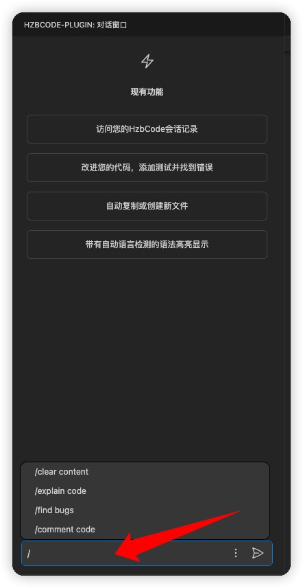

<h2 align="center">vscode-hzbcode-plugin</h2>
<br/>

#### 产品介绍：

- vscode-hzbcode-plugin 这是一个基于大语言模型 GPT 架构的聊天助手插件。通过 HzBankCode 插件，您可以在 Visual Studio Code 编辑器中进行自然语言交互，获得智能回答、建议和帮助，提高开发效率。

<br/>

#### 功能介绍：

- 自然语言交互：提供与大模型语言模型进行实时自然语言对话。
- 右键选中代码，提供查找错误、解释代码、添加注释等功能。大语言模型回答的答案会在左侧的输出面板中显示。
- 国际化（目前只支持中文和英文）

<br/>

#### 插件安装

<center></center>

- 依次点击上图箭头1和箭头2的图标，选择本地的vsix文件进行插件安装


<br />

#### 前提条件在开始使用 VSCode ChatGPT 插件之前，请确保满足以下要求：


- 安装 Visual Studio Code（版本 1.68 或更高）。
- 拥有内部大模型密钥。<span style="color: red">（注意：试用版本内置了试用的 apikey，可以直接使用，不需要通过下面的方法配置 apikey）</span>
  - 在扩展面板中搜索 "vscode-hzbcode-plugin"。点击 "安装" 按钮，并等待安装完成
  - 配置安装 `vscode-hzbcode-plugin` 插件后，您需要配置 API 密钥以连接到内部大模型服务。

#### 请按照以下步骤进行 apikey 配置：

<center></center>

- 系统会检测您是否已经配置了 api 密钥，如果没有配置，系统会自动弹窗，让您选择存储 apikey 的位置，推荐存储到会话中，不推荐配置到配置中。系统会自动将您的 api 密钥保存到本地。

- 打开 vscode-hzbcode-plugin 插件 在页面下方有更新设置、或者点击更多更新设置按钮 搜索关键字 api，输入自己申请到的 apikey，至此您已经完成了配置。

<br/>

#### 示例以下是一些对话示例：

- 用户： 你好，ChatGPT！如何创建一个函数？

- Ai： 您好！要创建一个函数，请使用 def 关键字，后跟函数名和参数列表。例如：def my_function(arg1, arg2):。

- 用户： 谢谢！你能帮我解决一个编译错误吗？

- Ai 当然可以！请提供错误消息和相关代码的详细信息，我将尽力帮助您找到解决方案。

<br/>

#### 使用方法

##### 对话聊天

<center></center>

- 在对话面板的输入框中输入任意内容，点击回车，即可开始（或者回车）对话。
- 可以使用组合快捷键`cmd+shift+z`（或者`ctrl+shift+z`）激活对话面板

##### 右键菜单

<center></center>

- 在编辑区中右键选中代码，点击右键，选择您需要的功能，即可获得 大模型 的回答。

##### 快捷命令

<center></center>

- 在对话界面的输入框中输入`\`, 会出先快捷命令，通过方向键上下选取。
  

#### 开发

- 安装依赖

```sh
npm install
```

- 打包

```sh
sudo npm install -g @vscode/vsce # 安装
vsce package --no-yarn # 打包为vsix文件
```

#### 其他

- 还有一些其他的小功能，可以到 config 中进行配置，比如是否开启自动滚动页面、关于 gpt 的配置等等。
